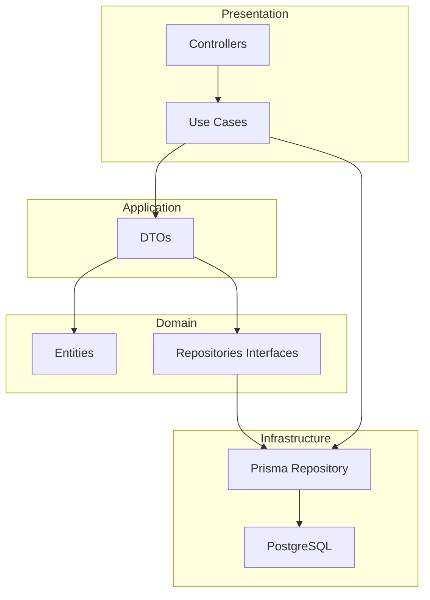

# 🚀 RESTful API with NestJS, TypeScript and Clean Architecture

## 🌐🇧🇷 [Versão Portuguesa](README.md)
## 🌐🇺🇸 [English Version](README_EN.md)

## 📋 About the Project

A practical project to build a RESTful API using Node.js, NestJS and TypeScript, applying **Clean Architecture**, **Domain-Driven Design (DDD)** and **SOLID** principles, with automated tests.

> This project is guided by Professor **Jorge Aluizio Alves de Souza**, who brings specialized insights on modern software architecture and testing practices.

### 🎯 Key Features

- ✅ Clean Architecture with well-defined layers
- ✅ Domain-Driven Design (DDD)
- ✅ SOLID Principles
- ✅ Automated tests (unit, integration and e2e)
- ✅ Prisma ORM for persistence
- ✅ Multi-environment configuration (development, test, production)
- ✅ API Documentation with Swagger

### 🔨 Project Features

- **User Registration**: Create new users in the system
- **Authentication**: Login with JWT (JSON Web Token)
- **List Users**: List all users with pagination (15 items per page)
- **Get User**: Display specific user data
- **Update User**: Update user name
- **Update Password**: Change user password
- **Delete User**: Remove user from system

### 📸 API Documentation (Swagger)


API documentation is available via Swagger at `/api` when the application is running.

### ✔️ Technologies Used

- **Node.js** - JavaScript Runtime
- **NestJS** - Node.js Framework
- **TypeScript** - Statically typed language
- **Prisma ORM** - Database ORM
- **PostgreSQL** - Relational database
- **JWT** - Token authentication
- **bcryptjs** - Password encryption
- **Jest** - Testing framework
- **Docker** - Containerization (optional)

### 📊 Project Architecture



### 📁 Project Structure

The project structure follows **Clean Architecture** and **Domain-Driven Design (DDD)** principles, organizing code into well-defined layers as shown in the image below:


---

### 📂 Structure Details

#### **Root Files**
```
src/
├── app.module.ts              # Root module - registers and coordinates all application modules
├── main.ts                   # Entry point - configures and initializes NestJS server
├── global-config.ts          # Global configurations (constants, environment variables)
├── app.controller.ts         # Root controller - GET / health check route
├── app.service.ts            # Root service - basic root business logic
```

#### **Users Module (`users/`)**
```
users/
├── application/              # 📋 Application Layer - Use Cases
│   ├── dtos/
│   │   └── user-output.ts    # Output DTO - defines format of data returned to client
│   └── usecases/
│       ├── signup.usecase.ts         # Creates new user in the system
│       ├── signin.usecase.ts         # Authenticates user and returns JWT token
│       ├── listusers.usecase.ts      # Lists users with pagination (15 per page)
│       ├── getuser.usecase.ts        # Finds individual user by ID
│       ├── update-user.usecase.ts    # Updates user data (name)
│       ├── update-password.usecase.ts # Changes user password
│       └── delete-user.usecase.ts    # Removes user from system
│
├── domain/                   # 💼 Domain Layer - Business Rules
│   ├── entities/
│   │   └── user.entity.ts   # User Entity - represents business object with validations
│   ├── repositories/
│   │   └── user.repository.ts  # Interface (contract) - defines repository operations
│   └── validators/
│       └── user.validator.ts   # Domain-specific validation rules
│
└── infrastructure/           # ⚙️ Infrastructure Layer - Implementations
    ├── users.controller.ts   # REST Controller - exposes API endpoints
    ├── users.module.ts       # NestJS Module - injects module dependencies
    ├── users.service.ts      # Main service (legacy - used with use cases)
    ├── presenters/
    │   └── user.presenter.ts # Presenter - transforms entity for API response
    ├── providers/hash-provider/
    │   └── bcryptjs-hash.provider.ts # Provider - password hash implementation
    ├── dtos/
    │   ├── signup.dto.ts      # Input validation for user creation
    │   ├── signin.dto.ts      # Input validation for login
    │   ├── list-users.dto.ts  # Pagination and filter parameters
    │   ├── update-user.dto.ts # Input validation for data update
    │   └── update-password.dto.ts # Input validation for password change
    └── database/
        ├── prisma/repositories/
        │   └── user-prisma.repository.ts # Prisma repository implementation
        ├── prisma/models/
        │   └── user-model.mapper.ts      # Mapper - converts entity ↔ Prisma model
        └── in-memory/repositories/
            └── user-in-memory.repository.ts # In-memory repository for testing
```

#### **Authentication Module (`auth/`)**
```
auth/
└── infrastructure/
    ├── auth.module.ts    # Authentication module - configures JWT and strategies
    ├── auth.service.ts   # Service - generates and validates JWT tokens
    └── auth.guard.ts    # Guard - protects routes requiring authentication
```

#### **Shared Module (`shared/`)**
```
shared/
├── application/              # Shared components between modules
│   ├── usecases/
│   │   └── use-case.ts      # Base interface - standard for all use cases
│   ├── errors/
│   │   ├── bad-request-error.ts       # Error 400 - invalid request
│   │   ├── invalid-credentials-error.ts # Error 401 - incorrect credentials
│   │   └── invalid-password-error.ts  # Error 400 - invalid password
│   └── dtos/
│       └── pagination-output.ts      # Standard pagination DTO
│
├── domain/                  # Shared domain components
│   └── validators/
│       ├── validator-fields.interface.ts    # Generic validator interface
│       └── class-validator-fields.ts        # Implementation using class-validator
│
└── infrastructure/          # Shared infrastructure
    ├── env-config/         # Environment variables configuration
    ├── database/prisma/    # Prisma service and test configurations
    ├── presenters/         # Response formatters (pagination, collection)
    ├── interceptors/       # HTTP interceptors (response wrapper)
    └── exception-filters/  # Exception filters (404, 401, 409, etc)
```

---

### 📖 Clean Architecture Layer Explanation

| Layer | Responsibility | Dependencies |
|-------|----------------|--------------|
| **Presentation** (`*/infrastructure`) | Receives HTTP requests, returns responses, validates input | Has no business rules |
| **Application** (`*/application`) | Orchestrates use cases, coordinates entities, applies business rules | Depends only on Domain |
| **Domain** (`*/domain`) | Contains pure business rules, entities, interfaces | No external dependencies |
| **Infrastructure** (`*/infrastructure`) | External implementations: database, HTTP, cache, etc | Implements Domain interfaces |

### 🎯 Data Flow (Request → Response)

```
1. HTTP Request
      ↓
2. Controller (receives request, validates DTO)
      ↓
3. Use Case (executes business logic)
      ↓
4. Entity (applies business rules)
      ↓
5. Repository Interface (contract)
      ↓
6. Repository Implementation (Prisma)
      ↓
7. Database (PostgreSQL)
      ↓
Return: Entity → Use Case → Presenter → Controller → HTTP Response
```

## 🛠️ Prerequisites

- Node.js (version 18.x or higher)
- npm or yarn
- PostgreSQL (version 14.x or higher)
- Docker (optional)

## 🚀 Getting Started

### 1️⃣ Installation

```bash
# Clone the repository
git clone https://github.com/your-user/restful-api-nestjs-clean-architecture.git

# Enter the directory
cd restful-api-nestjs-clean-architecture

# Install dependencies
npm install
```

### 2️⃣ Environment Setup

```bash
# Rename the example file
cp .env.example .env

# Configure environment variables in .env file
# IMPORTANT: Change the variables as indicated
```

### 3️⃣ Database Setup

```bash
# Generate Prisma client
npx prisma generate

# Run migrations
npx prisma migrate dev
```

### 4️⃣ Run the Application

```bash
# Development mode
npm run start:dev
```

## 📦 Available NPM Scripts

```bash
# Development
npm run start           # Start the application
npm run start:dev    # Start in development mode
npm run start:debug  # Start in debug mode
npm run start:prod   # Start in production mode

# Build
npm run build          # Build the application

# Tests
npm run test           # Unit tests
npm run test:watch   # Tests with watch
npm run test:cov     # Tests with coverage
npm run test:e2e     # End-to-end tests
npm run test:int     # Integration tests
npm run test:all     # All tests

# Lint
npm run lint           # Run ESLint
npm run format         # Format code with Prettier
```

## 🧪 Tests

### Unit Tests
```bash
npm run test
```

### Integration Tests
```bash
npm run test:int
```

### E2E Tests
```bash
npm run test:e2e
```

### All Tests
```bash
npm run test:all
```

## 🐳 Docker (Optional)

```bash
# Run PostgreSQL with Docker
docker run --name postgres-nest -e POSTGRES_PASSWORD=postgres -e POSTGRES_USER=postgres -e POSTGRES_DB=nestjs-clean-arch-dev -p 5432:5432 -d postgres:14

# Or with Docker Compose
docker-compose up -d
```

## 🌿 Commit Standards

- `feat:` - New feature
- `fix:` - Bug fix
- `docs:` - Documentation
- `style:` - Code formatting
- `refactor:` - Refactoring
- `test:` - Tests
- `chore:` - Build/dependencies tasks

## 🌐 Deploy

### Render.com

1. Connect your GitHub repository to Render
2. Configure environment variables
3. Run build command: `npm run build`
4. Run start command: `npm run start:prod`

## 📚 Business Rules

- Fields name, email and password are required
- Field createdAt is automatically filled
- Duplicate email registration is not allowed
- Password is encrypted with bcrypt
- Listings are paginated with 15 items per page

## 📚 Additional Documentation

- [Professor Jorge Aluizio Course](https://www.aluiziodeveloper.com.br/curso-de-nodejs-avan%C3%A7ado-com-clean-architecture-nestjs-e-typescript/)
- [NestJS Documentation](https://docs.nestjs.com/)
- [Prisma Documentation](https://www.prisma.io/docs/)
- [Clean Architecture](https://blog.cleancoder.com/uncle-bob/2012/08/13/the-clean-architecture.html)
- [Book: Clean Architecture - Robert C. Martin](https://www.amazon.com/Clean-Architecture-Handy-Software-Structure/dp/0132350882)
- [Book: Domain-Driven Design - Vaughn Vernon](https://www.amazon.com/Implementing-Domain-Driven-Design-Vaughn-Vernon/dp/0321834577)

## ✨ Contribution

1. Fork the project
2. Create a branch for your feature (`git checkout -b feature/NewFeature`)
3. Commit your changes (`git commit -m 'feat: add new feature'`)
4. Push to the branch (`git push origin feature/NewFeature`)
5. Open a Pull Request

---

<p align="center">
  ⭐️ Project developed during Professor Jorge Aluizio's course ⭐️
</p>

<p align="center">
  Developed by Felipe Moreira
</p>
