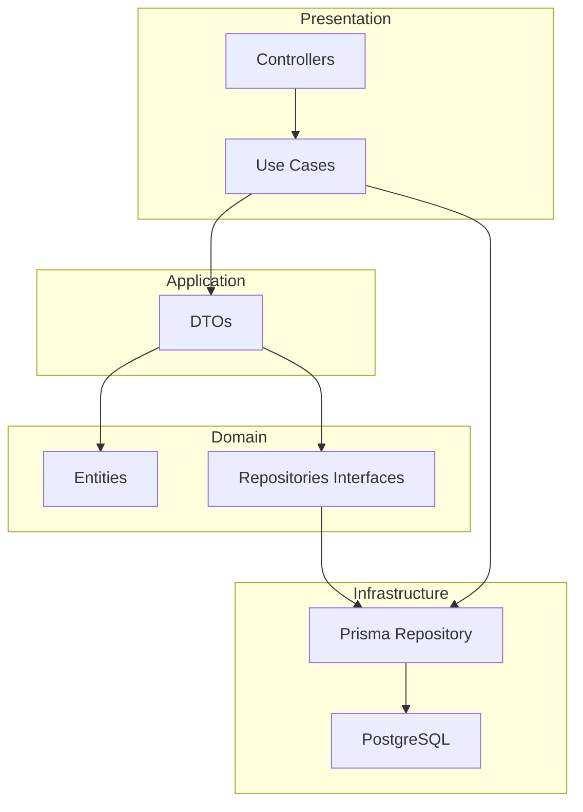

# 🚀 RESTful API with NestJS, TypeScript and Clean Architecture

## 🌐🇧🇷 [Versão Portuguesa](README.md)
## 🌐🇺🇸 [English Version](README_EN.md)

## 📋 About the Project

A practical project to build a RESTful API using Node.js, NestJS and TypeScript, applying **Clean Architecture**, **Domain-Driven Design (DDD)** and **SOLID** principles, with automated tests.

> This project is guided by Professor **Jorge Aluizio Alves de Souza**, who brings specialized insights on modern software architecture and testing practices.

### 🎯 Key Features

- ✅ Clean Architecture with well-defined layers
- ✅ Domain-Driven Design (DDD)
- ✅ SOLID Principles
- ✅ Automated tests (unit, integration and e2e)
- ✅ Prisma ORM for persistence
- ✅ Multi-environment configuration (development, test, production)
- ✅ API Documentation with Swagger (planned)

### 🔨 Project Features

- **User Registration**: Create new users in the system
- **Authentication**: Login with JWT (JSON Web Token)
- **List Users**: List all users with pagination (15 items per page)
- **Get User**: Display specific user data
- **Update User**: Update user name
- **Update Password**: Change user password
- **Delete User**: Remove user from system

### ✔️ Technologies Used

- **Node.js** - JavaScript Runtime
- **NestJS** - Node.js Framework
- **TypeScript** - Statically typed language
- **Prisma ORM** - Database ORM
- **PostgreSQL** - Relational database
- **JWT** - Token authentication
- **bcryptjs** - Password encryption
- **Jest** - Testing framework
- **Docker** - Containerization (optional)

### 📊 Project Architecture



### 📁 Project Structure

```
src/
├── app.module.ts          # Main module
├── main.ts               # Entry point
├── users/                # Users module
│   ├── application/      # Application layer
│   │   ├── dtos/        # Data Transfer Objects
│   │   └── usecases/   # Use cases
│   ├── domain/          # Domain layer
│   │   ├── entities/   # Entities
│   │   └── repositories/ # Repository interfaces
│   └── infrastructure/  # Infrastructure layer
│       ├── controllers/ # NestJS Controllers
│       ├── dtos/       # DTOs
│       └── database/   # Prisma Implementation
├── auth/                 # Authentication module
└── shared/              # Shared resources
    ├── application/     # Shared application
    ├── domain/         # Shared entities and errors
    └── infrastructure/ # Filters, interceptors, etc.
```

## 🛠️ Prerequisites

- Node.js (version 18.x or higher)
- npm or yarn
- PostgreSQL (version 14.x or higher)
- Docker (optional)

## 🚀 Getting Started

### 1️⃣ Installation

```bash
# Clone the repository
git clone https://github.com/your-user/restful-api-nestjs-clean-architecture.git

# Enter the directory
cd restful-api-nestjs-clean-architecture

# Install dependencies
npm install
```

### 2️⃣ Environment Setup

```bash
# Rename the example file
cp .env.example .env

# Configure environment variables in .env file
# IMPORTANT: Change the variables as indicated
```

### 3️⃣ Database Setup

```bash
# Generate Prisma client
npx prisma generate

# Run migrations
npx prisma migrate dev
```

### 4️⃣ Run the Application

```bash
# Development mode
npm run start:dev
```

## 📦 Available NPM Scripts

```bash
# Development
npm run start           # Start the application
npm run start:dev    # Start in development mode
npm run start:debug  # Start in debug mode
npm run start:prod   # Start in production mode

# Build
npm run build          # Build the application

# Tests
npm run test           # Unit tests
npm run test:watch   # Tests with watch
npm run test:cov     # Tests with coverage
npm run test:e2e     # End-to-end tests
npm run test:int     # Integration tests
npm run test:all     # All tests

# Lint
npm run lint           # Run ESLint
npm run format         # Format code with Prettier
```

## 🧪 Tests

### Unit Tests
```bash
npm run test
```

### Integration Tests
```bash
npm run test:int
```

### E2E Tests
```bash
npm run test:e2e
```

### All Tests
```bash
npm run test:all
```

## 🐳 Docker (Optional)

```bash
# Run PostgreSQL with Docker
docker run --name postgres-nest -e POSTGRES_PASSWORD=postgres -e POSTGRES_USER=postgres -e POSTGRES_DB=nestjs-clean-arch-dev -p 5432:5432 -d postgres:14

# Or with Docker Compose
docker-compose up -d
```

## 🌿 Commit Standards

- `feat:` - New feature
- `fix:` - Bug fix
- `docs:` - Documentation
- `style:` - Code formatting
- `refactor:` - Refactoring
- `test:` - Tests
- `chore:` - Build/dependencies tasks

## 🌐 Deploy

### Render.com

1. Connect your GitHub repository to Render
2. Configure environment variables
3. Run build command: `npm run build`
4. Run start command: `npm run start:prod`

## 📚 Business Rules

- Fields name, email and password are required
- Field createdAt is automatically filled
- Duplicate email registration is not allowed
- Password is encrypted with bcrypt
- Listings are paginated with 15 items per page

## 📚 Additional Documentation

- [Professor Jorge Aluizio Course](https://www.aluiziodeveloper.com.br/curso-de-nodejs-avan%C3%A7ado-com-clean-architecture-nestjs-e-typescript/)
- [NestJS Documentation](https://docs.nestjs.com/)
- [Prisma Documentation](https://www.prisma.io/docs/)
- [Clean Architecture](https://blog.cleancoder.com/uncle-bob/2012/08/13/the-clean-architecture.html)
- [Book: Clean Architecture - Robert C. Martin](https://www.amazon.com/Clean-Architecture-Handy-Software-Structure/dp/0132350882)
- [Book: Domain-Driven Design - Vaughn Vernon](https://www.amazon.com/Implementing-Domain-Driven-Design-Vaughn-Vernon/dp/0321834577)

## ✨ Contribution

1. Fork the project
2. Create a branch for your feature (`git checkout -b feature/NewFeature`)
3. Commit your changes (`git commit -m 'feat: add new feature'`)
4. Push to the branch (`git push origin feature/NewFeature`)
5. Open a Pull Request

---

<p align="center">
  ⭐️ Project developed during Professor Jorge Aluizio's course ⭐️
</p>

<p align="center">
  Developed by Felipe Moreira
</p>
